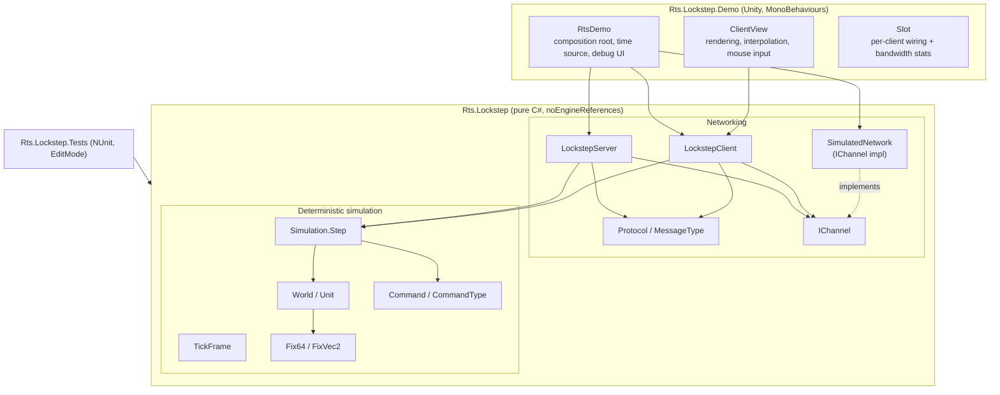
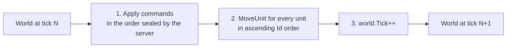
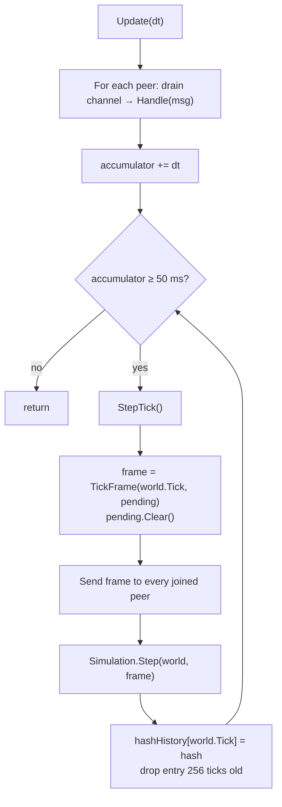
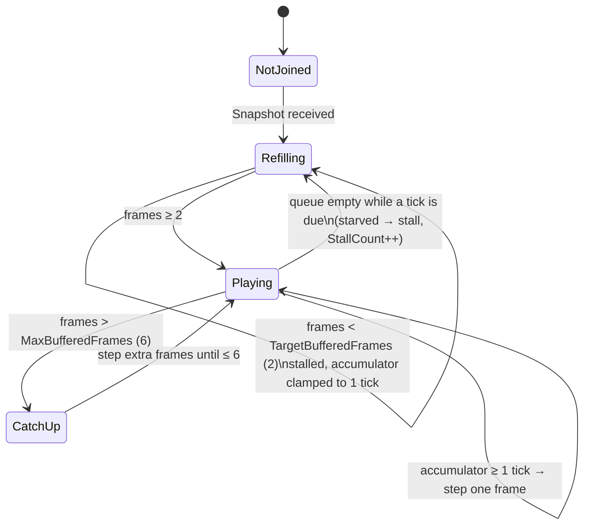
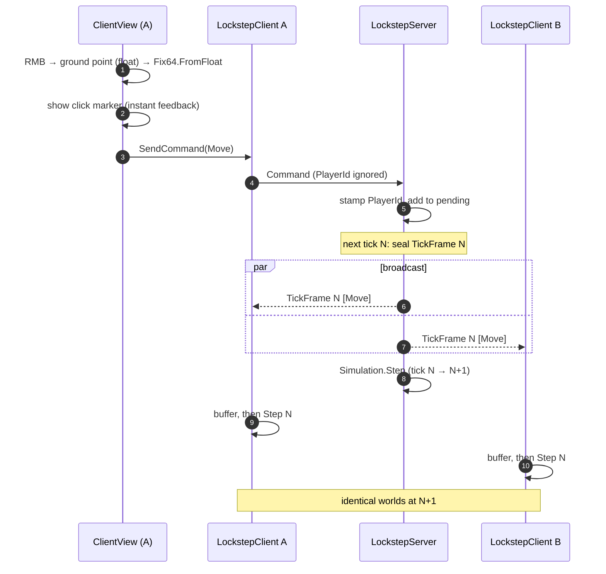
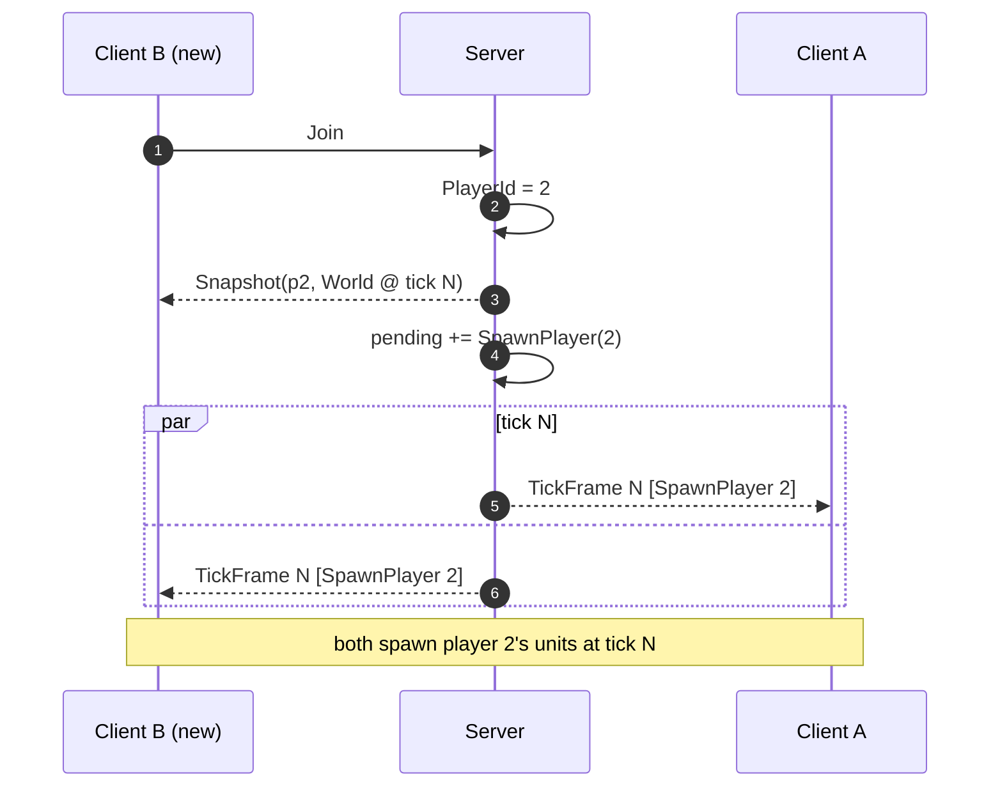
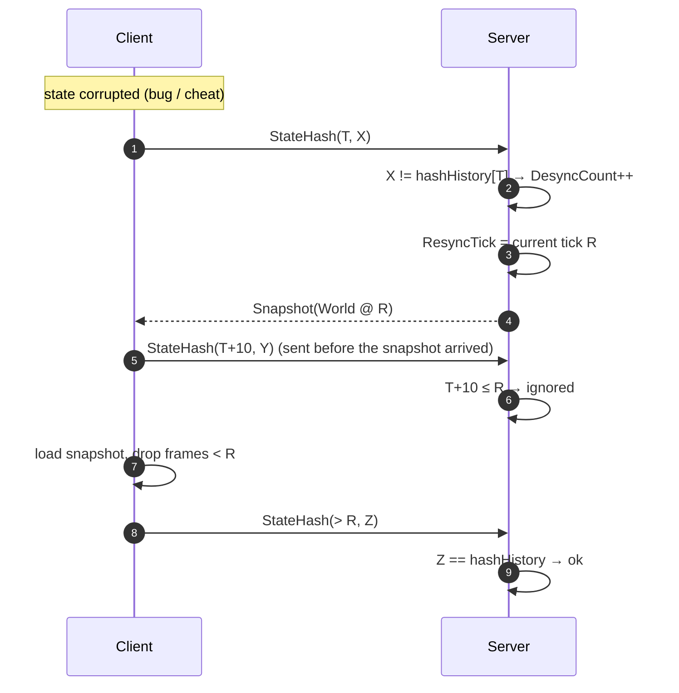

# Architecture & Code Logic

This document explains how the sample works internally: the layers, the data that flows
between them, and the exact runtime logic of the server, the client and the simulation.
For a short intro and "how to run", see the [README](../README.md). For review findings,
see [CODE_REVIEW.md](CODE_REVIEW.md).

All paths below are relative to `rts-determenistic-lockstep-sample/Assets/Code/`.

---

## 1. The idea in one paragraph

Every peer (the server and each client) runs the **same deterministic simulation**
(`Simulation.Step`). The network carries only **player orders** (`Command`), grouped by the
server into one **`TickFrame` per tick**. If every peer starts from the same `World` and applies
the same frames in the same order, every peer ends up with a bit-identical `World`. No unit
positions are sent during normal play. The server is **authoritative**: it owns the clock, the
order of commands and player identity, and it runs the simulation itself so it can hand out
snapshots (late join) and verify client state hashes (desync detection).

---

## 2. Layers and assemblies



| Assembly | asmdef | Depends on | Notes |
|---|---|---|---|
| `Rts.Lockstep` | `Core/Rts.Lockstep.asmdef` | nothing | `noEngineReferences: true` — the compiler guarantees `UnityEngine` (and therefore `float`-based `Mathf`, `Time`, `Random`) can't leak into the simulation. |
| `Rts.Lockstep.Demo` | `Demo/Rts.Lockstep.Demo.asmdef` | `Rts.Lockstep` | Presentation + input + debug UI. |
| `Rts.Lockstep.Tests` | `Tests/Rts.Lockstep.Tests.asmdef` | `Rts.Lockstep` | Unit + integration tests, no scene needed. |

**Dependency rule:** arrows only point *into* Core. The simulation layer (`Simulation`, `World`,
`Command`, `Fix64`) knows nothing about the network; the network layer knows nothing about Unity.
This is what makes the whole server + two clients testable in a single NUnit method.

---

## 3. Core building blocks

### 3.1 Fixed-point math — `Fix64`, `FixVec2`

- `Fix64` is a `readonly struct` wrapping a `long` in **Q48.16** format (`Raw = value * 65536`).
- All arithmetic is integer arithmetic, so results are bit-identical on every CPU, runtime
  (Mono / IL2CPP / .NET) and optimisation level.
- `*` is `(a.Raw * b.Raw) >> 16`, `/` is `(a.Raw << 16) / b.Raw`. Both truncate deterministically.
- `Sqrt` uses an integer Newton iteration (`ISqrt`) on `raw << 16`, so it is also bit-exact.
- Conversion boundaries:
  - `FromFloat` — **input only**: a mouse click is converted once, on one machine, and the exact
    `long` is sent over the wire.
  - `ToFloat` — **output only**: rendering and debug text.
  - `FromRatio(n, d)` — the deterministic way to author fractional constants
    (e.g. `UnitSpeedPerTick = FromRatio(1, 5)`).
- `FixVec2` is a 2D vector of two `Fix64`. The map is the (X, Y) plane; the view maps it to Unity's
  X/Z.

### 3.2 State — `World`, `Unit`

```text
World
 ├─ Tick        : int      (number of ticks already simulated)
 ├─ NextUnitId  : int      (monotonic id generator)
 └─ Units       : List<Unit>   (always sorted by Id)

Unit { Id, Owner (player id), Position, Target, IsMoving }
```

- `Units` is **append-only with growing ids**, so it is always sorted by `Id`. That gives a
  deterministic iteration order and allows `FindUnit` to be a binary search.
- `ComputeHash()` — FNV-1a over every field of the state (tick, id generator, every unit field,
  `long`s mixed as two `int`s, byte by byte). Two peers with equal hashes have (with very high
  probability) identical worlds.
- `Write` / `Read` — full binary snapshot, used for late join and resync. The snapshot contains
  exactly the fields that the hash covers, so `Read(Write(w)).ComputeHash() == w.ComputeHash()`
  (covered by the `Snapshot_RoundTrip_KeepsHash` test).

### 3.3 Input — `Command`, `CommandType`

| Type | Issued by | Payload | Effect |
|---|---|---|---|
| `SpawnPlayer` | server only (on Join) | `PlayerId` | Spawns `UnitsPerPlayer` (6) units in a grid at the player's base. Idempotent. |
| `Move` | client | `UnitIds[]`, `Target` | Owned units get `Target + FormationOffset`, `IsMoving = true`. |
| `Stop` | client | `UnitIds[]` | Owned units: `Target = Position`, `IsMoving = false`. |

- `PlayerId` is **overwritten by the server** from the connection, so a client can't issue orders
  on behalf of someone else.
- Wire format: `[type:u8][playerId:u8][count:u8][ids:i32 × count][targetX:i64][targetY:i64]`.
  `Read` rejects `count > MaxUnitsPerCommand (64)`.

### 3.4 The deterministic step — `Simulation.Step(world, commands)`



Details:

1. **Apply commands.** For `Move`/`Stop` the unit list is filtered by `CollectOwnedUnits`: unknown
   ids, units of another player and duplicates are dropped. Validation lives **inside** the
   simulation, so an invalid order is ignored identically on every peer (it can't cause a desync).
   A `Move` spreads the group with `FormationOffset(i, count)`: a centred square grid with
   `FormationSpacing = 1.5 m`.
2. **Move units.** Each moving unit advances `UnitSpeedPerTick = 0.2 m` (4 m/s at 20 Hz) towards
   its target: `pos += toTarget * (speed / distance)`. If the remaining distance is ≤ one step it
   snaps to the target and stops.
3. **Advance the tick counter.**

Constants: `TicksPerSecond = 20`, `TickDuration = 50 ms`, `UnitsPerPlayer = 6`, four base
positions (player `p` uses `PlayerBases[(p - 1) % 4]`).

### 3.5 Protocol — `Protocol`, `MessageType`, `TickFrame`

Every message is `[MessageType:u8][payload]`, written with `BinaryWriter` (little-endian).

| Message | Direction | Payload | Size |
|---|---|---|---|
| `Join` | C → S | — | 1 B |
| `Command` | C → S | `Command` | 19 B + 4 B per unit (43 B for 6 units) |
| `StateHash` | C → S | `tick:i32`, `hash:u32` | 9 B, every 10 ticks |
| `TickFrame` | S → C | `tick:i32`, `count:u16`, `Command × count` | 7 B when empty |
| `Snapshot` | S → C | `playerId:u8`, `World` | 14 B + 38 B per unit |

An idle match therefore costs about `7 B × 20 = 140 B/s` downstream per client, **regardless of
the number of units** — the key property of lockstep.

### 3.6 Transport — `IChannel`, `SimulatedNetwork`, `LinkSettings`

- `IChannel` is the only thing the lockstep code knows about the network:
  `Send(byte[])`, `TryReceive(out byte[])`, `BytesSent`. It must be **reliable and ordered**.
- `SimulatedNetwork` is an in-process implementation. `Connect` creates two `Pipe`s (up/down) and
  returns the two `Endpoint`s. Each packet gets
  `deliverAt = max(now + latency + random(0..jitter), lastDeliverAt)`; the `max` keeps packets
  in order, emulating TCP head-of-line blocking. Time is advanced explicitly (`Advance(dt)`),
  so tests are fully reproducible.
- `LinkSettings` is a mutable reference, so the demo sliders change latency/jitter live.

---

## 4. The server — `LockstepServer`

State: `_world`, `_peers` (channel, `PlayerId`, `Joined`, `ResyncTick`), `_pendingCommands`,
`_hashHistory` (tick → hash, last 256 ticks), a time accumulator.



Message handling:

- **Join** (once per peer): assign the next `PlayerId`, send a `Snapshot` of the current world
  (tick N) and enqueue `SpawnPlayer` into the pending commands. Because the channel is ordered, the
  snapshot of tick N always arrives *before* frame N, and frame N contains the spawn — so every
  peer, including the new one, spawns the units at the same tick.
- **Command**: ignored before Join and for `SpawnPlayer`; otherwise `PlayerId` is stamped from the
  connection and the command is appended to `_pendingCommands`. The **arrival order at the server
  is the execution order** on every peer.
- **StateHash**: `CheckHash` compares with `_hashHistory[tick]`. On mismatch: `DesyncCount++`,
  `peer.ResyncTick = world.Tick`, send a fresh `Snapshot`. Hashes with `tick ≤ ResyncTick` were
  already in flight when the resync was sent, so they are ignored (prevents a resync storm).

The server never waits for clients: frames are sealed on its own clock, even empty ones. A slow
client only hurts itself.

---

## 5. The client — `LockstepClient`

State: `World` (null until the first snapshot), `PlayerId`, a queue of received `TickFrame`s, a
time accumulator, `_refillingBuffer`, and `_previousPositions` (rendering only).

### 5.1 Receiving

- **Snapshot** → replace `World`, set `PlayerId`, clear interpolation history, drop queued frames
  older than the snapshot tick.
- **TickFrame** → enqueue if `World != null && frame.Tick ≥ World.Tick`.

### 5.2 Playback state machine



In code (`LockstepClient.Update`):

1. Drain the channel.
2. `accumulator += dt`.
3. **Refilling** and fewer than 2 frames → stay stalled, clamp the accumulator to one tick
   (no time debt piles up while frozen) and return.
4. **Playing**: while at least one tick of time is accumulated, dequeue and step a frame. If the
   queue runs dry, go back to *Refilling* — the client **freezes rather than predicts**.
5. **Catch-up**: if more than 6 frames are queued (after a lag spike), step the extra frames
   immediately, without waiting for time.

`StepFrame` asserts `frame.Tick == World.Tick` (a gap or reorder would be a transport bug), stores
the positions for interpolation, runs `Simulation.Step`, and every 10 ticks sends
`StateHash(World.Tick, World.ComputeHash())`.

### 5.3 Rendering support

`InterpolationAlpha = accumulator / TickDuration` (clamped to 1) and `GetPreviousPosition(unit)`
let the view lerp between the last two ticks. While stalled the accumulator is clamped to one tick,
so alpha = 1 and units stand still at the latest simulated position (no extrapolation).

---

## 6. End-to-end flows

### 6.1 A move order



**Perceived input latency** ≈ one-way up + wait for the next tick seal (0–50 ms) + one-way down +
time spent in the jitter buffer (0–2 ticks) + one tick of interpolation. With the demo's client A
(40 ms ± 10 ms) this is roughly 200–300 ms, hidden by the click marker.

### 6.2 Late join



### 6.3 Desync detection and resync



---

## 7. Unity integration — `Demo/`

### `RtsDemo` (composition root)

- Creates one `SimulatedNetwork`, one `LockstepServer` and two `Slot`s (client A: 40 ± 10 ms,
  client B: 150 ± 50 ms). Each slot = a channel pair + `LockstepClient` + `ClientView` placed at a
  different world origin (0 and x = 1000) with half of the screen as viewport.
- Client A joins immediately; client B joins when you press **Join** (late join demo).
- `Update` is the **single time source**: `network.Advance(dt)`, `server.Update(dt)`,
  `clientA.Update(dt)`, `clientB.Update(dt)`. Each side converts real time into whole ticks with
  its own accumulator.
- Debug UI (IMGUI): tick, ticks behind the server, buffered frames, stalls, hash, downstream
  bandwidth, latency/jitter sliders, "Corrupt local state" button. Gizmos draw the server's world
  as yellow wire spheres over both views, so you can see the server running ahead.

### `ClientView` (presentation + input)

- **Read-only** with respect to the simulation: it reads `client.World`, never writes to it.
- `LateUpdate` → `SyncUnitViews`: create/destroy a capsule per unit id, lerp between
  `GetPreviousPosition` and `Position` with `InterpolationAlpha`, colour by owner / selection.
  Views of units missing from the world (e.g. after a snapshot) are destroyed.
- `Update` → `HandleInput`: LMB click/box selects **own** units; RMB raycasts a ground plane,
  converts the point with `Fix64.FromFloat` and sends `Command.Move`; `S` sends `Command.Stop`.

---

## 8. Determinism rules (enforced by design)

| Rule | Where it's enforced |
|---|---|
| No `float` in the simulation | `Fix64`/`FixVec2`; Core asmdef has no Unity references. |
| Defined iteration order | `World.Units` is a `List` sorted by id; commands keep server order. |
| No wall clock | Fixed 50 ms tick; time is only an accumulator outside `Simulation`. |
| No external state | `Simulation` is static and touches only `World` + `Command`s. |
| Validation is part of the simulation | `CollectOwnedUnits`, idempotent `SpawnPlayer`. |
| Identity is server-side | `PlayerId` stamped from the connection. |
| Floats only at the edges | `FromFloat` on input, `ToFloat` for rendering. |

---

## 9. Tests — `Tests/LockstepTests.cs`

| Test | What it proves |
|---|---|
| `Fix64_BasicMath` | sqrt, division, negative multiplication, vector magnitude. |
| `SameCommands_ProduceIdenticalWorlds` | Two worlds fed the same 600 random frames have equal hashes every tick (no hidden shared state or order dependence). |
| `Snapshot_RoundTrip_KeepsHash` | `World.Write`/`Read` is lossless. |
| `Command_ForSomeoneElsesUnits_IsIgnored` | Ownership validation inside the simulation. |
| `ServerAndClients_StayInSync_WithLatencyJitterAndLateJoin` | 30 s full-stack run: two clients with different latency/jitter, uneven frame times, random orders, a late join — zero desyncs. |
| `Desync_IsDetected_AndFixedBySnapshot` | A corrupted client is detected exactly once and is healthy after the snapshot. |

---

## 10. Extension points

- **Real transport:** implement `IChannel` over TCP or a reliable UDP channel (the only
  requirement is reliable + ordered). Nothing else changes.
- **New gameplay:** add a `CommandType`, handle it in `Simulation.Apply`, keep new state in
  `World` and include every new field in `ComputeHash`, `Write` and `Read`.
- **Randomness:** add a PRNG state (e.g. xorshift seed) to `World`, hash and serialise it.
- **Replays:** record every `TickFrame`; playback = `Simulation.Step` over the recording.
